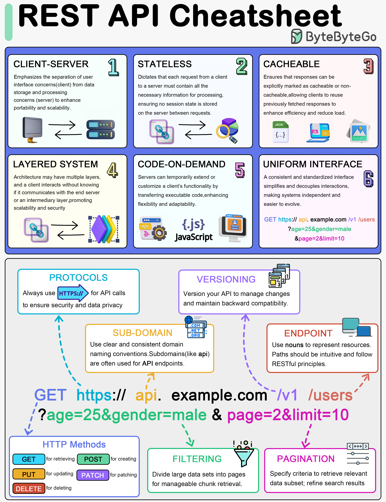

# REST API Cheatsheet

## Giới thiệu

Hướng dẫn ngắn gọn về các nguyên lý, thành phần và best practices trong thiết kế RESTful APIs.

## Nội dung

- **6 nguyên lý cơ bản của REST API**: Stateless, Client-Server, Cacheable, Uniform Interface, Layered System, Code on Demand.
- **Các thành phần chính**: HTTP Methods (GET, POST, PUT, DELETE), Status Codes, Headers, Request/Response Body.
- **Phiên bản API**: Cách quản lý và triển khai phiên bản API.
- **Thực tiễn tốt**: Pagination, Filtering, Endpoint Design.

---

## Tham khảo

- [ByteByteGo REST API Cheatsheet](https://bytebytego.com/guides/rest-api-cheatsheet/)
